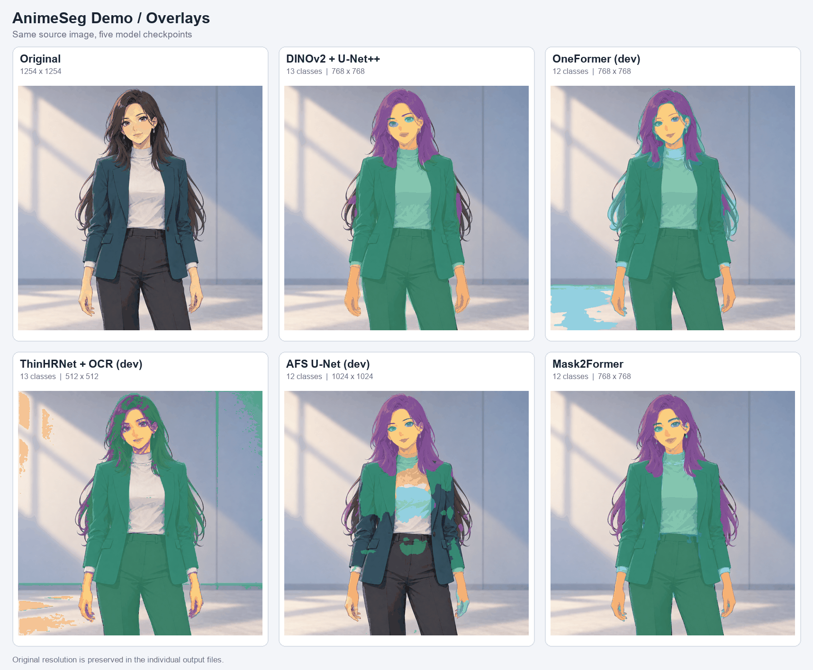

# AnimeSeg Demo

[Zenn記事](https://zenn.dev/suzukimain/articles/bef0dc4a1510c3)で扱ったsegmentation architectureを共通interfaceから実行するminimal inference demo。

## Example



[Color-mask comparison](examples/test/comparison_masks.png)

## Supported Models

| Folder | Architecture | Checkpoint | Classes | Input Size |
|---|---|---|---:|---|
| dinov2_unetpp/ | DINOv2 + U-Net++ | dinov2_unetpp.safetensors | 13 | 768 × 768 |
| oneformer/ | OneFormer | oneformer_dev.safetensors | 12 | 768 × 768 |
| thinhrnet_ocr/ | ThinHRNet + OCR | thinhrnet_ocr_dev.safetensors | 13 | 512 × 512 |
| afs/ | AFS U-Net | afs_unet_dev.safetensors | 12 | 1024 × 1024 |
| mask2former/ | Mask2Former | mask2former.safetensors | 12 | 768 × 768 |

## Quick Start

Python 3.10以降。CUDAを使う場合は対応するPyTorchをインストールしてください。

```bash
pip install .
```

```python
from anime_seg_demo import AnimeSegPipelineDemo

pipe = AnimeSegPipelineDemo.from_mask2former().to("cuda")
mask = pipe("input.png")
```

入力は画像pathまたはPIL.Image。戻り値は元画像と同じ高さ・幅の
`numpy.ndarray`（int32、class ID）です。CPUでは`.to("cpu")`を使えます。

## Available Loaders

```python
AnimeSegPipelineDemo.from_dinov2_unetpp()
AnimeSegPipelineDemo.from_oneformer()
AnimeSegPipelineDemo.from_thinhrnet_ocr()
AnimeSegPipelineDemo.from_afs()
AnimeSegPipelineDemo.from_mask2former()
```

各loaderはHFルートのconfig.jsonと選択したcheckpointを取得します。checkpointは全モデルsafetensors形式です。
ローカルbundleは`from_mask2former(model_dir="hf_upload/mask2former")`のように指定できます。
`repo_id`、`revision`、`local_files_only`、`cache_dir`も指定可能です。

## Model Weights

https://huggingface.co/suzukimain/AnimeSeg-demo


